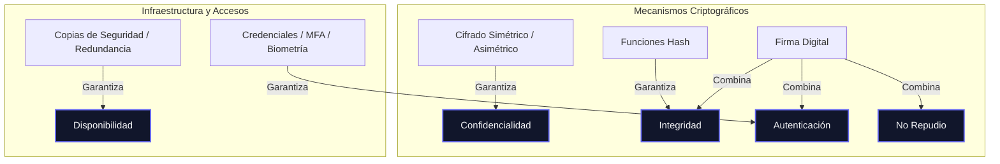

# Dimensiones de la Seguridad de la Información

Este esquema te ayudará a comprender y diferenciar las 5 dimensiones fundamentales de la seguridad (también conocidas como dimensiones de la seguridad o el acrónimo CID/AIC ampliado), así como las técnicas utilizadas para garantizarlas.

---

## 1. Mapa de Relaciones

El siguiente diagrama muestra cómo interactúan las dimensiones básicas y qué mecanismos complejos (como la firma digital) combinan varias de ellas simultáneamente.

---

## 2. Tabla Comparativa de Dimensiones

| Dimensión | Pregunta Clave | Definición | ¿Cómo se ataca? (Amenaza) | ¿Cómo se garantiza? (Mecanismo) | Ejemplo Práctico |
| :--- | :--- | :--- | :--- | :--- | :--- |
| **Confidencialidad** | *¿Quién puede leerlo?* | Asegurar que la información solo sea accesible para quienes tengan autorización. | Espionaje, filtraciones, robo de datos (*Eavesdropping*). | Cifrado (AES, RSA), control de acceso estricto (roles), túneles VPN. | Enviar un mensaje cifrado que solo el destinatario con la clave privada puede abrir. |
| **Integridad** | *¿Se ha modificado?* | Garantizar que la información permanezca inalterada frente a modificaciones no autorizadas o accidentales. | Manipulación de datos, inyección de código, alteración en tránsito. | Funciones Hash (SHA-256), firmas digitales, checksums. | Descargar un software y comprobar que su hash coincide con el publicado por el desarrollador. |
| **Disponibilidad** | *¿Puedo usarlo cuando lo necesito?* | Garantizar que los usuarios autorizados tengan acceso a los recursos y datos siempre que lo requieran. | Ataques DDoS, ransomware, cortes de luz, fallos de hardware. | Backups (copias de seguridad), redundancia (RAID, servidores espejo), balanceadores de carga. | Un servidor web secundario que toma el control si el principal sufre un apagón. |
| **Autenticación** | *¿Es quien dice ser?* | Confirmar la identidad de un usuario, dispositivo o sistema de manera inequívoca. | Suplantación de identidad (*Phishing*, *Spoofing*), robo de credenciales. | Contraseñas, MFA (doble factor), certificados digitales, datos biométricos. | Introducir tu contraseña y luego un código temporal (OTP) enviado a tu móvil para entrar a la banca online. |
| **No Repudio** | *¿Puede negar que lo hizo?* | Impedir que una entidad niegue haber realizado una acción o haber enviado/recibido un mensaje. | Rechazar la autoría de una transacción comercial o un correo electrónico crítico. | Firmas digitales (criptografía asimétrica) con certificados de entidad emisora confiable. | Firmar digitalmente un contrato laboral en formato PDF con tu DNI electrónico o certificado digital. |

---

> [!NOTE]
> **La clave del No Repudio:** 
> Para que exista no repudio, se requiere la combinación de **Autenticación** (identificar quién lo hizo) e **Integridad** (asegurar que el documento firmado no fue modificado). Si ambos se cumplen criptográficamente a través de una firma digital asimétrica, el emisor no puede repudiar (negar) la acción ante un tercero (por ejemplo, un juez).

---

## 3. Escenarios Comunes de Examen (Fácil Confusión)

### A. Autenticación vs. Confidencialidad
* **Error común:** Pensar que poner contraseña a un usuario garantiza confidencialidad.
* **Aclaración:** La contraseña es **Autenticación** (demuestra tu identidad). El **cifrado** de los datos que lees después es lo que garantiza la **Confidencialidad** (si alguien intercepta los paquetes de red, no podrá leerlos).

### B. Integridad vs. No Repudio
* **Error común:** Pensar que con calcular el Hash (SHA-256) de un mensaje se evita que alguien diga "yo no lo escribí".
* **Aclaración:** El Hash por sí solo solo garantiza **Integridad** (que no ha cambiado). Cualquiera puede calcular el Hash de cualquier texto. Para evitar que el autor lo niegue (**No Repudio**), se requiere cifrar ese Hash con la clave privada del autor (**Firma Digital**).

### C. Autenticación de Origen vs. No Repudio
* **Error común:** Confundir la autenticación del remitente con el no repudio.
* **Aclaración:** La autenticación de origen de un mensaje de correo (ej. SPF/DKIM) demuestra al servidor de destino que el correo proviene de un dominio legítimo. Sin embargo, no proporciona **No Repudio de Origen** legal completo frente a terceros si no se ha firmado digitalmente con un certificado de usuario individual específico y no repudiable.
